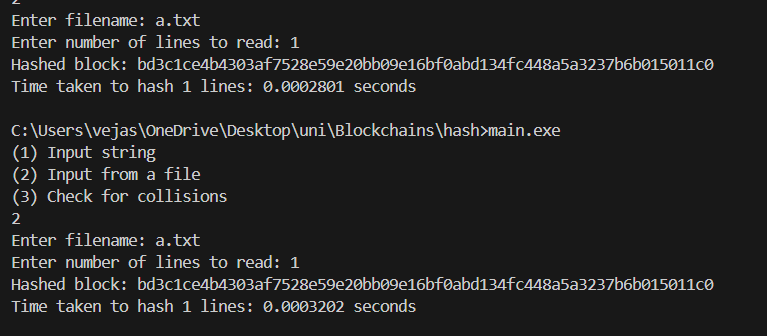

# Hash funkcijos interpretacija
----
## 'Hashas' funkcijos aprašymas pseudo-kodu

### Pradinės reikšmės:
```
Sukurti state[4] masyvą su pradinėmis reikšmėmis, hasho 'atminčiai':
    state[0] = 0xabcdef1234567890
    state[1] = 0xfedcba9876543210  
    state[2] = 0xa12b34c56d78e90f
    state[3] = 0xa1b2c3d4e5f60708
```

### 1 MAIŠYMO ETAPAS - Simbolių apdorojimas:
```
Kiekvienam simboliui įvestyje:
    ascii = simbolio ASCII kodas (0-255)
    pozicija = simbolio numeris mod 4
    
    state[pozicija] XOR= (ascii * 0x0101010101010101)
    
    kita_pozicija = (pozicija + 1) mod 4
    shift_kiekis = simbolio_numeris mod 56
    state[kita_pozicija] += (ascii << shift_kiekis)
```

### 2 ETAPAS - Tarpusavio maišymas:
```
Kiekvienam i nuo 0 iki 3:
    // Cirkuliarinis maišymas (0->1->2->3->0)
    state[i] XOR= state[(i+1) mod 4]
    
    state[i] *= 3
```

### 3 ETAPAS - Diagonalinis maišymas:
```
Kiekvienam i nuo 0 iki 3:
    // Diagonalinis maišymas (0->2, 1->3)
    state[i] += state[(i+2) mod 4]
    
    // Aukštųjų ir žemųjų bitų maišymas
    state[i] XOR= (state[i] >> 16)
```

### 4 ETAPAS - Konvertavimas į hex string'ą:
```
Kiekvienam state masyvo elementui:
    Konvertuoti į 16 simbolių hex string'ą
    Pridėti prie rezultato

Grąžinti 64 simbolių hex string'ą
```
# Tyrimai
## Išvedimo dydis
* Nesvarbu kokio ilgio įvestis, išvestis visuomet gaunama 64 simboliu hex formatu

| Įvestis            | Išvestis                                                         | 
| -------------------|-------------------------------------------------------- -------- | 
| labas              | 8d1eed0a380a626adeb8d2edd26ebb2c97ef5eae13f5d384a69391ba5f33c253 | 
| Labas              | 2cbdd30e080df40aba9997ee906ea9ee378e98cb05f230675e55431919b44db3 | 
| 'Konstitucija.txt' | 41095fbb83160526352bd1686947b43899efb055ff532512b6d5ceb1ccbf417  | 
| 'a.txt'            | bd3c1ce4b4303af7528e59e20bb09e16bf0abd134fc448a5a3237b6b015011c0 | 
| 'b.txt'            | 65b55b1fb6e44f710e7b757739bb6d028571d7036c00c2a2bb5eb843ea40202f | 

## Determiniškumas



## Efektyvumo testas naudojant 'Konstitucija.txt'
| Eil. sk. | 'hashas' (s) | 
| -------- | ------- |  
| 8        | 0.00090 | 
| 16       | 0.00051 | 
| 32       | 0.00079 | 
| 64       | 0.00035 | 
| 128      | 0.00035 |
| 256      | 0.00045 |
| 512      | 0.00086 |
| 789      | 0.00122 |


## Kolizijų paieška iš 100 000 porų
| 'String' ilgis | Kolizijų sk. |
| --------       | -------      | 
| 2              |   243        |
| 5              |     0        |
| 10             |     0        |
| 100            |     0        |
| 500            |     0        |
| 1000           |     0        |